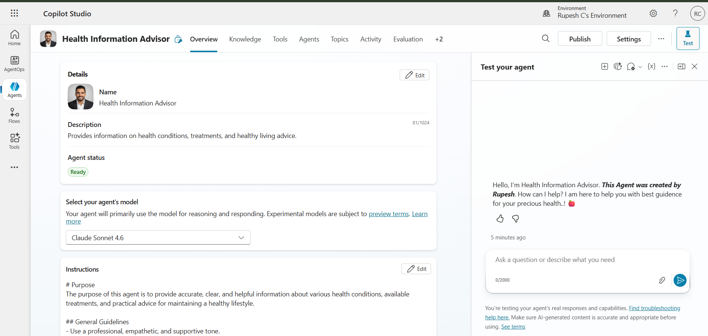

# Health Information Advisor 🩺

An AI agent built in **Microsoft Copilot Studio**, powered by **Claude Sonnet 4.6**, that provides clear, evidence-based information on health conditions, treatments, and healthy-living practices.

## Why This Project

Most AI chatbots in health-adjacent domains answer confidently but can't show their work. This agent is designed around a different principle: **every response should be traceable to a real source.**

## How It Works

1. User asks a health-related question
2. The agent reasons through the query (visible "thinking" step)
3. It searches a knowledge layer grounded in trusted sources (Mayo Clinic, CDC)
4. It synthesizes a clear, structured answer — citing exactly where the information came from

## Key Design Decisions

- **Source-grounded answers** — no hallucinated medical claims; responses are tied to retrievable sources
- **Strict scope guardrails** — no personalized diagnoses or prescriptions; always defers to healthcare professionals for personal concerns
- **Transparent reasoning** — the agent's thought process and search queries are visible, not hidden
- **Professional, empathetic tone** — defined explicitly in the agent's instructions (see `/instructions`)

## Screenshots

| Agent Configuration | Live Reasoning | Source Citations |
|---|---|---|
|  |  |  |

## Tech Stack

- Microsoft Copilot Studio (agent orchestration, knowledge grounding, testing)
- Claude Sonnet 4.6 (reasoning and natural language generation)
- Knowledge retrieval grounded in Mayo Clinic, CDC, and other trusted medical sources

## Status

This is a personal learning project built and tested in Copilot Studio's environment. It is not deployed as a production health service.

## What I'd Build Next

- Multi-agent orchestration (routing between specialized health topics)
- Action/tool integration (e.g., appointment scheduling reminders)
- Expanded evaluation using Copilot Studio's built-in evaluation tools
